# Otonari (お隣): System Design

Describes version v4 as it is implemented. Last checked against the code and a running server on 24 Nov 2026.

1. [Overview](#1-overview) · 2. [Architecture](#2-system-architecture) · 3. [Roles](#3-roles-and-permissions) ·
4. [Data model](#4-data-model) · 5. [Language-neutral messages](#5-language-neutral-messages) · 6. [Data flow](#6-data-flow) ·
7. [User journeys](#7-user-journeys) · 8. [Sequences](#8-sequence-diagrams) · 9. [States](#9-state-machines) ·
10. [API](#10-api) · 11. [Security](#11-security-and-privacy) · 12. [Completion status](#12-completion-status) ·
13. [Trade-offs and next steps](#13-trade-offs-and-next-steps)

## 1. Overview

Neighbors in Japan live meters apart but rarely ask each other for help: language, shyness and 遠慮 (enryo).
Otonari lets people in one building or block lend and borrow things. **Messages are never typed**: a message is a
phrase key plus values, and everybody reads it in their own language (English, Japanese, Easy Japanese, Bengali).

| Part | Technology |
|---|---|
| Client | React 18, Vite, TypeScript, react-router, plain CSS, PWA |
| Server | Node.js (runs TypeScript directly), Express 5, modular monolith |
| Database | PostgreSQL (17 in Docker), 13 tables |
| Photos | Private AWS S3 with signed URLs (1 hour), or `server/uploads` |
| Login | Password, code by email (SMTP), Google |
| Updates | HTTP polling: shelf 3 s, inbox and notice 5 s. No WebSocket |

## 2. System architecture

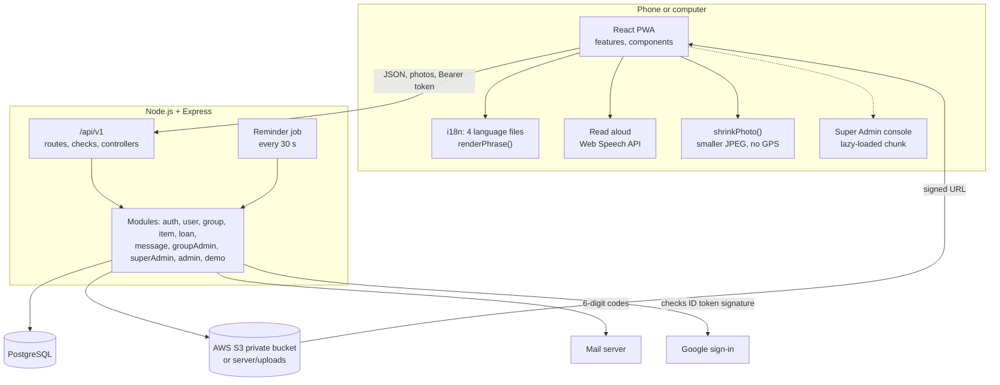
```mermaid
flowchart TB
  subgraph Device["Phone or computer"]
    UI["React PWA<br/>features, components"]
    I18N["i18n: 4 language files<br/>renderPhrase()"]
    TTS["Read aloud<br/>Web Speech API"]
    SHRINK["shrinkPhoto()<br/>smaller JPEG, no GPS"]
    SA["Super Admin console<br/>lazy-loaded chunk"]
    UI --> I18N
    UI --> TTS
    UI --> SHRINK
    UI -.-> SA
  end
  subgraph Server["Node.js + Express"]
    API["/api/v1<br/>routes, checks, controllers"]
    MOD["Modules: auth, user, group, item, loan,<br/>message, groupAdmin, superAdmin, admin, demo"]
    REM["Reminder job<br/>every 30 s"]
    API --> MOD
    REM --> MOD
  end
  DB[("PostgreSQL")]
  S3[("AWS S3 private bucket<br/>or server/uploads")]
  SMTP["Mail server"]
  GOOGLE["Google sign-in"]
  UI -->|"JSON, photos, Bearer token"| API
  MOD --> DB
  MOD --> S3
  MOD -->|"6-digit codes"| SMTP
  MOD -->|"checks ID token signature"| GOOGLE
  S3 -->|"signed URL"| UI
```

Two ways to run it:

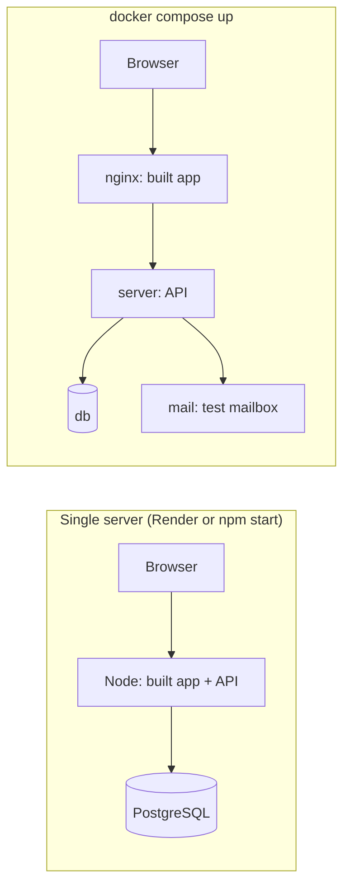
```mermaid
flowchart LR
  subgraph One["Single server (Render or npm start)"]
    B1["Browser"] --> N1["Node: built app + API"] --> P1[("PostgreSQL")]
  end
  subgraph Compose["docker compose up"]
    B2["Browser"] --> NG["nginx: built app"] --> N2["server: API"] --> P2[("db")]
    N2 --> M2["mail: test mailbox"]
  end
```

### Inside the server

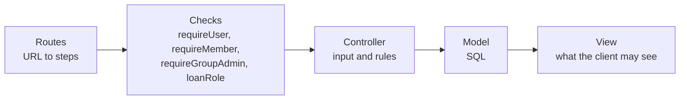
```mermaid
flowchart LR
  R["Routes<br/>URL to steps"] --> C["Checks<br/>requireUser, requireMember,<br/>requireGroupAdmin, loanRole"]
  C --> K["Controller<br/>input and rules"]
  K --> M["Model<br/>SQL"]
  M --> V["View<br/>what the client may see"]
```

- `read()` is for requests that change nothing; `write()` is one transaction behind one global lock, so what was checked stays true.
- Uploads: check who it is, receive in memory (5 MB, real image bytes), store, then the transaction. A replaced photo is deleted afterwards.
- `core/allowedKeys.ts` is the allowlist of phrases, spots, days and languages. Items and categories are checked against the database.
- `addNewColumns()` migrates an existing database at every start, without a reset.

## 3. Roles and permissions

There are exactly three stored roles. "Visitor", "applicant", "muted" and "suspended" are situations, not roles.

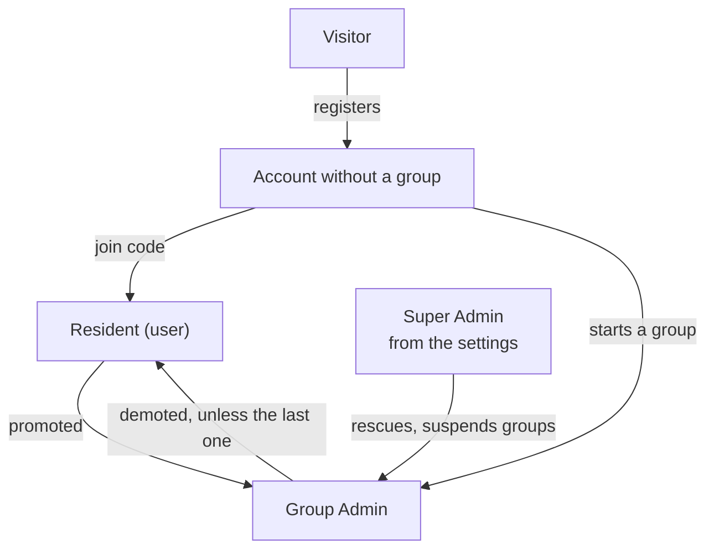
```mermaid
flowchart TB
  V["Visitor"] -->|"registers"| U["Account without a group"]
  U -->|"join code"| R["Resident (user)"]
  U -->|"starts a group"| G["Group Admin"]
  R -->|"promoted"| G
  G -->|"demoted, unless the last one"| R
  S["Super Admin<br/>from the settings"] -->|"rescues, suspends groups"| G
```

| Can | Resident | Group Admin | Super Admin |
|---|---|---|---|
| Borrow, lend, photo of own items, request new items | yes | yes | only as a member |
| Approve neighbors, mute, suspend, remove, trust | | own group | account deactivation |
| Hide, edit, approve items | own items | own group | |
| Check-ins, force return, escalate | | own group | |
| Notices, poster, join code, group image | | own group | join code |
| Groups, catalog, categories, accounts, audit log | | | yes |
| Loan photos and messages | own loans | **all loans of the group** | Break-Glass only |

Group Admins are equal. The last active one cannot be demoted, removed or suspended, and cannot leave (Last-Admin Lock).

## 4. Data model

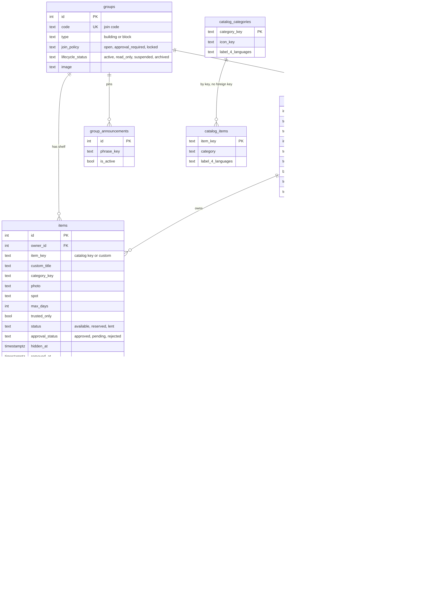
```mermaid
erDiagram
  groups ||--o{ users : "has members"
  groups ||--o{ items : "has shelf"
  groups ||--o{ group_announcements : "pins"
  users ||--o{ items : "owns"
  users ||--o{ sessions : "logged in on"
  items ||--o{ loans : "is lent in"
  users ||--o{ loans : "borrower, lender"
  loans ||--o{ messages : "conversation"
  loans ||--o{ loan_disputes : "flagged in"
  catalog_categories ||--o{ catalog_items : "by key, no foreign key"
  groups {
    int id PK
    text code UK "join code"
    text type "building or block"
    text join_policy "open, approval_required, locked"
    text lifecycle_status "active, read_only, suspended, archived"
    text image
  }
  users {
    int id PK
    text email UK
    text role "user, group_admin, super_admin"
    int group_id FK
    text nickname
    text lang "en, ja, ja-easy, bn"
    bool elder_mode
    text member_status "pending, active, borrow_muted, suspended"
    text trust_override
  }
  items {
    int id PK
    int owner_id FK
    text item_key "catalog key or custom"
    text custom_title
    text category_key
    text photo
    text spot
    int max_days
    bool trusted_only
    text status "available, reserved, lent"
    text approval_status "approved, pending, rejected"
    timestamptz hidden_at
    timestamptz removed_at
  }
  loans {
    int id PK
    int item_id FK
    int borrower_id FK
    int lender_id FK
    timestamptz start_at
    timestamptz end_at
    text status
    text handover_photo
    text return_photo
    timestamptz returned_at
  }
  messages {
    int id PK
    int loan_id FK
    int from_user_id "null = system"
    int to_user_id FK
    text phrase_key
    jsonb params "keys and raw values"
    timestamptz read_at
  }
  loan_disputes {
    int id PK
    text reason_key
    bool escalated_to_super_admin
    text status
  }
  catalog_items {
    text item_key PK
    text category
    text label_4_languages
  }
  catalog_categories {
    text category_key PK
    text icon_key
    text label_4_languages
  }
  sessions {
    text token_hash PK
    timestamptz expires_at "30 days"
  }
  group_announcements {
    int id PK
    text phrase_key
    bool is_active
  }
```

Also: `email_codes`, `registrations` (tickets) and `audit_logs` (the code only inserts and reads; the migration rewrote old co-admin labels).

Rules: no translated text is stored; removing an item is a soft delete, because loans point to it; a return is on time
if the return photo came before `end_at`, however slowly the lender confirms it.

## 5. Language-neutral messages

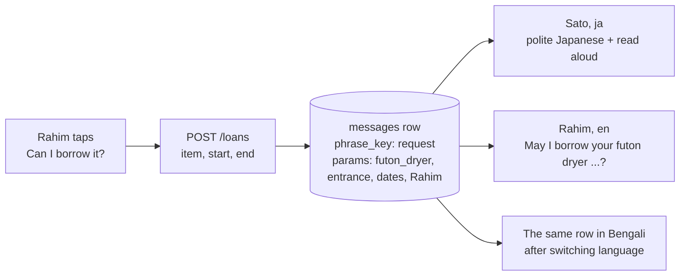
```mermaid
flowchart LR
  A["Rahim taps<br/>Can I borrow it?"] --> P["POST /loans<br/>item, start, end"]
  P --> DB[("messages row<br/>phrase_key: request<br/>params: futon_dryer, entrance, dates, Rahim")]
  DB --> J["Sato, ja<br/>polite Japanese + read aloud"]
  DB --> E["Rahim, en<br/>May I borrow your futon dryer ...?"]
  DB --> B["The same row in Bengali<br/>after switching language"]
```

No AI and no translation service at run time. Fallback: `ja-easy` to `ja` to `en`, and `bn` to `en`.
Exception: a custom item's title (`item_label`) is shown as it was written, in every language.

## 6. Data flow

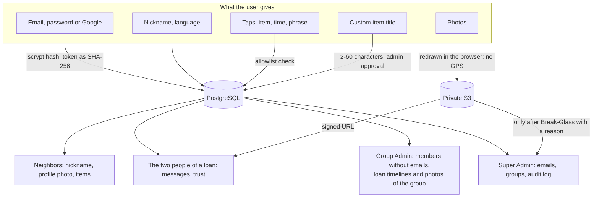
```mermaid
flowchart TB
  subgraph In["What the user gives"]
    E["Email, password or Google"]
    N["Nickname, language"]
    PH["Photos"]
    T["Taps: item, time, phrase"]
    CT["Custom item title"]
  end
  E -->|"scrypt hash; token as SHA-256"| DB[("PostgreSQL")]
  N --> DB
  PH -->|"redrawn in the browser: no GPS"| S3[("Private S3")]
  T -->|"allowlist check"| DB
  CT -->|"2-60 characters, admin approval"| DB
  DB --> NB["Neighbors: nickname, profile photo, items"]
  DB --> TWO["The two people of a loan: messages, trust"]
  S3 -->|"signed URL"| TWO
  DB --> GA["Group Admin: members without emails,<br/>loan timelines and photos of the group"]
  DB --> SA["Super Admin: emails, groups, audit log"]
  S3 -->|"only after Break-Glass with a reason"| SA
```

## 7. User journeys

### 7.1 Where everybody starts

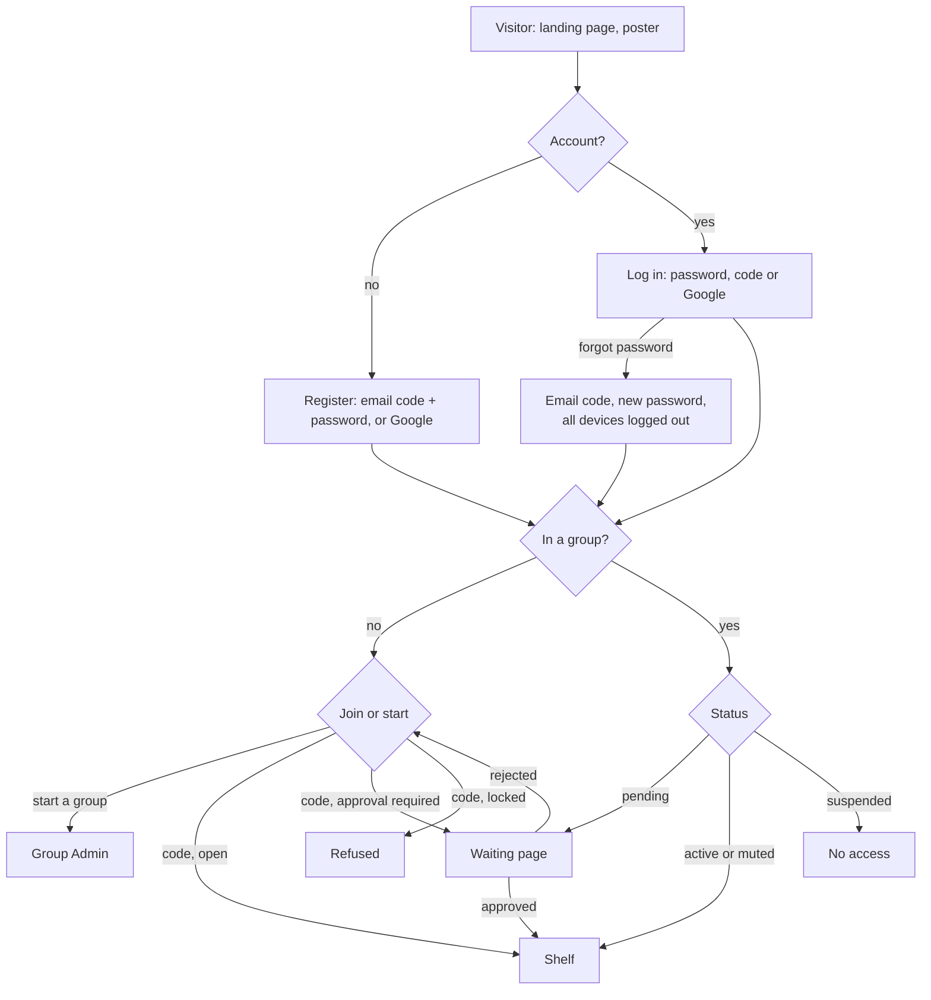
```mermaid
flowchart TB
  V["Visitor: landing page, poster"] --> Q{"Account?"}
  Q -->|"no"| REG["Register: email code + password, or Google"]
  Q -->|"yes"| LOG["Log in: password, code or Google"]
  LOG -->|"forgot password"| RES["Email code, new password,<br/>all devices logged out"]
  REG --> H{"In a group?"}
  LOG --> H
  RES --> H
  H -->|"no"| J{"Join or start"}
  H -->|"yes"| ST{"Status"}
  J -->|"start a group"| GA["Group Admin"]
  J -->|"code, open"| SH["Shelf"]
  J -->|"code, approval required"| W["Waiting page"]
  J -->|"code, locked"| X["Refused"]
  W -->|"approved"| SH
  W -->|"rejected"| J
  ST -->|"pending"| W
  ST -->|"active or muted"| SH
  ST -->|"suspended"| X2["No access"]
```

### 7.2 Borrower

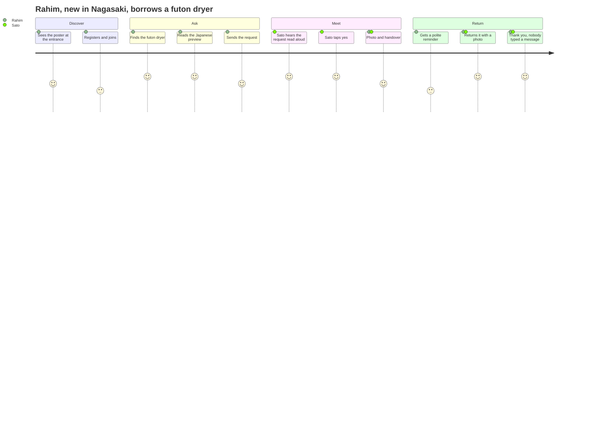
```mermaid
journey
  title Rahim, new in Nagasaki, borrows a futon dryer
  section Discover
    Sees the poster at the entrance: 4: Rahim
    Registers and joins: 3: Rahim
  section Ask
    Finds the futon dryer: 5: Rahim
    Reads the Japanese preview: 5: Rahim
    Sends the request: 4: Rahim
  section Meet
    Sato hears the request read aloud: 5: Sato
    Sato taps yes: 5: Sato
    Photo and handover: 4: Rahim, Sato
  section Return
    Gets a polite reminder: 3: Rahim
    Returns it with a photo: 5: Rahim, Sato
    Thank you, nobody typed a message: 5: Rahim, Sato
```

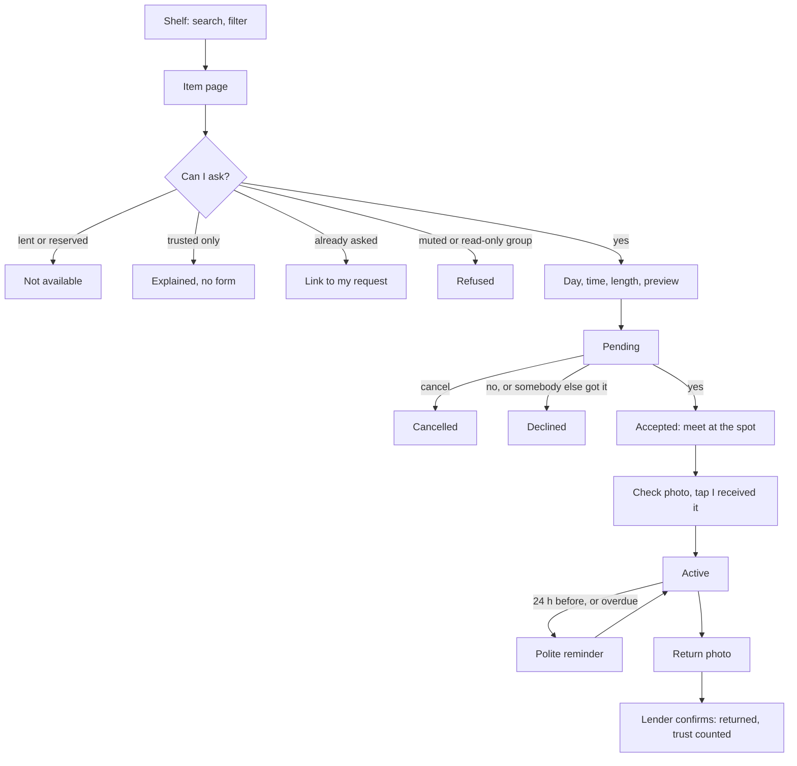
```mermaid
flowchart TB
  S["Shelf: search, filter"] --> I["Item page"]
  I --> C{"Can I ask?"}
  C -->|"lent or reserved"| N1["Not available"]
  C -->|"trusted only"| N2["Explained, no form"]
  C -->|"already asked"| N3["Link to my request"]
  C -->|"muted or read-only group"| N4["Refused"]
  C -->|"yes"| F["Day, time, length, preview"]
  F --> P["Pending"]
  P -->|"cancel"| E1["Cancelled"]
  P -->|"no, or somebody else got it"| E2["Declined"]
  P -->|"yes"| A["Accepted: meet at the spot"]
  A --> R["Check photo, tap I received it"]
  R --> AC["Active"]
  AC -->|"24 h before, or overdue"| M["Polite reminder"]
  M --> AC
  AC --> RP["Return photo"]
  RP --> D["Lender confirms: returned, trust counted"]
```

### 7.3 Lender (and elderly neighbor)

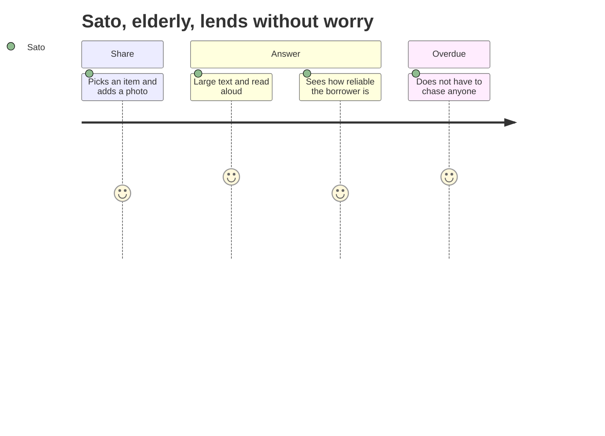
```mermaid
journey
  title Sato, elderly, lends without worry
  section Share
    Picks an item and adds a photo: 4: Sato
  section Answer
    Large text and read aloud: 5: Sato
    Sees how reliable the borrower is: 4: Sato
  section Overdue
    Does not have to chase anyone: 5: Sato
```

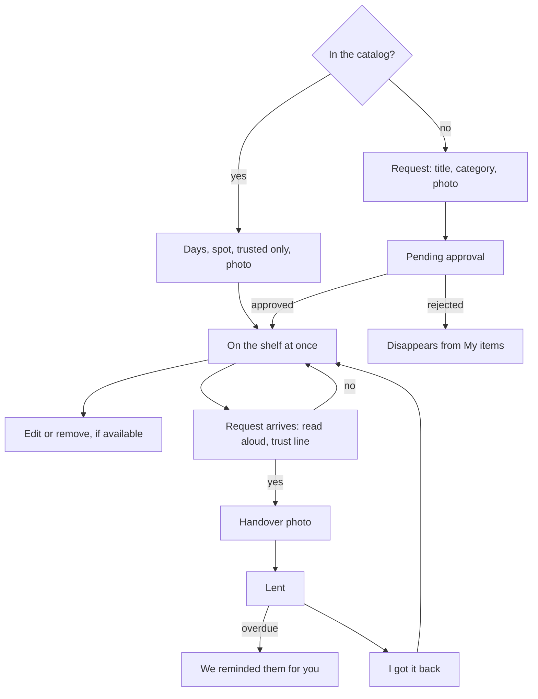
```mermaid
flowchart TB
  Q{"In the catalog?"} -->|"yes"| A["Days, spot, trusted only, photo"] --> L["On the shelf at once"]
  Q -->|"no"| R["Request: title, category, photo"] --> P["Pending approval"]
  P -->|"approved"| L
  P -->|"rejected"| G["Disappears from My items"]
  L --> E["Edit or remove, if available"]
  L --> B["Request arrives: read aloud, trust line"]
  B -->|"no"| L
  B -->|"yes"| H["Handover photo"] --> LE["Lent"]
  LE -->|"overdue"| T["We reminded them for you"]
  LE --> C["I got it back"] --> L
```

Elder Mode: 22 px text, 64 px buttons, read aloud on messages. Easy Japanese is a language of its own.

### 7.4 Applicant, muted and suspended residents

| Situation | Can | Cannot |
|---|---|---|
| Applicant (pending) | see the waiting page, profile | see the shelf, withdraw *(gap)* |
| Borrowing paused (muted) | look, lend, finish loans | send new requests |
| Suspended | log in | use the group, finish open loans or leave *(gaps)* |
| Group read-only | look, finish loans | new items, new requests |
| Group suspended or archived | log in | use the group |
| Account deactivated | nothing | log in |

### 7.5 Group Admin

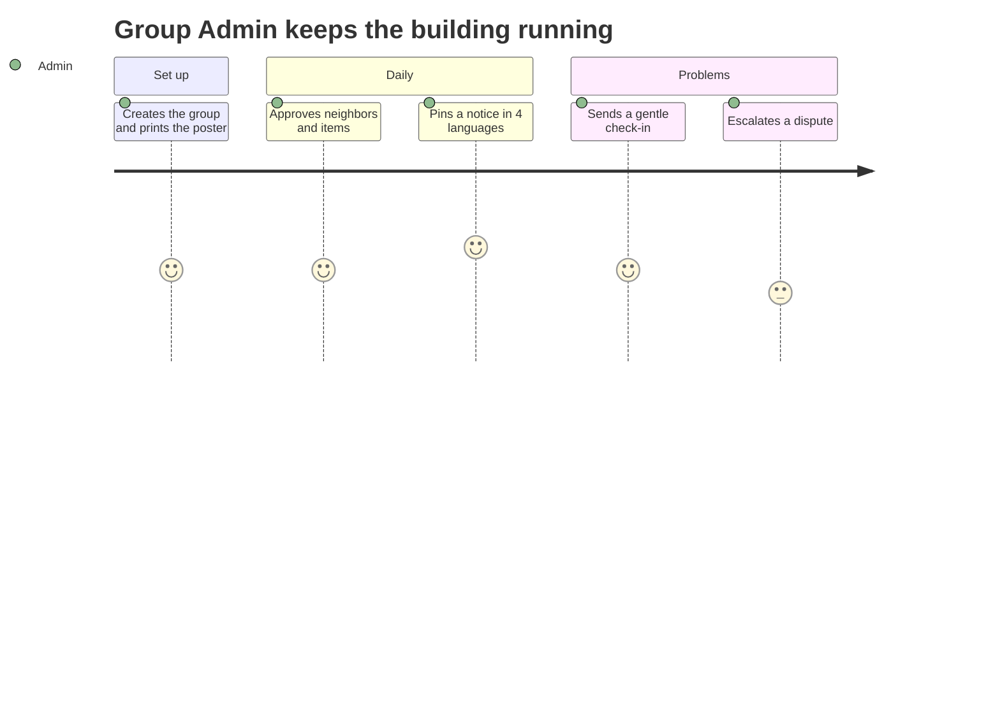
```mermaid
journey
  title Group Admin keeps the building running
  section Set up
    Creates the group and prints the poster: 4: Admin
  section Daily
    Approves neighbors and items: 4: Admin
    Pins a notice in 4 languages: 5: Admin
  section Problems
    Sends a gentle check-in: 4: Admin
    Escalates a dispute: 3: Admin
```

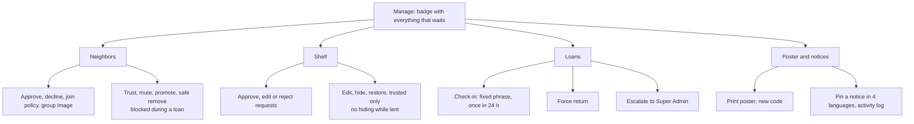
```mermaid
flowchart TB
  D["Manage: badge with everything that waits"] --> N["Neighbors"]
  D --> S["Shelf"]
  D --> L["Loans"]
  D --> P["Poster and notices"]
  N --> N1["Approve, decline, join policy, group image"]
  N --> N2["Trust, mute, promote, safe remove<br/>blocked during a loan"]
  S --> S1["Approve, edit or reject requests"]
  S --> S2["Edit, hide, restore, trusted only<br/>no hiding while lent"]
  L --> L1["Check-in: fixed phrase, once in 24 h"]
  L --> L2["Force return"]
  L --> L3["Escalate to Super Admin"]
  P --> P1["Print poster, new code"]
  P --> P2["Pin a notice in 4 languages, activity log"]
```

### 7.6 Super Admin

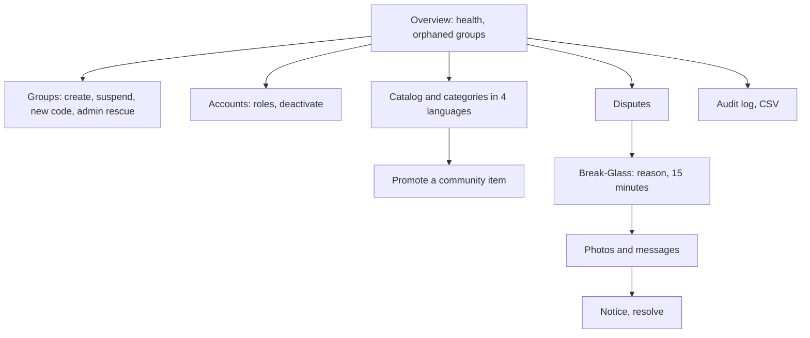
```mermaid
flowchart TB
  O["Overview: health, orphaned groups"] --> G["Groups: create, suspend, new code, admin rescue"]
  O --> A["Accounts: roles, deactivate"]
  O --> C["Catalog and categories in 4 languages"]
  C --> PR["Promote a community item"]
  O --> X["Disputes"]
  X --> BG["Break-Glass: reason, 15 minutes"]
  BG --> EV["Photos and messages"]
  EV --> RS["Notice, resolve"]
  O --> AU["Audit log, CSV"]
```

### 7.7 The system itself

Every 30 s the reminder job looks at active loans without a return photo: 24 h before the end it reminds the borrower,
and when overdue it reminds the borrower and tells the lender. Each reminder is sent once.

## 8. Sequence diagrams

### 8.1 Registering and joining

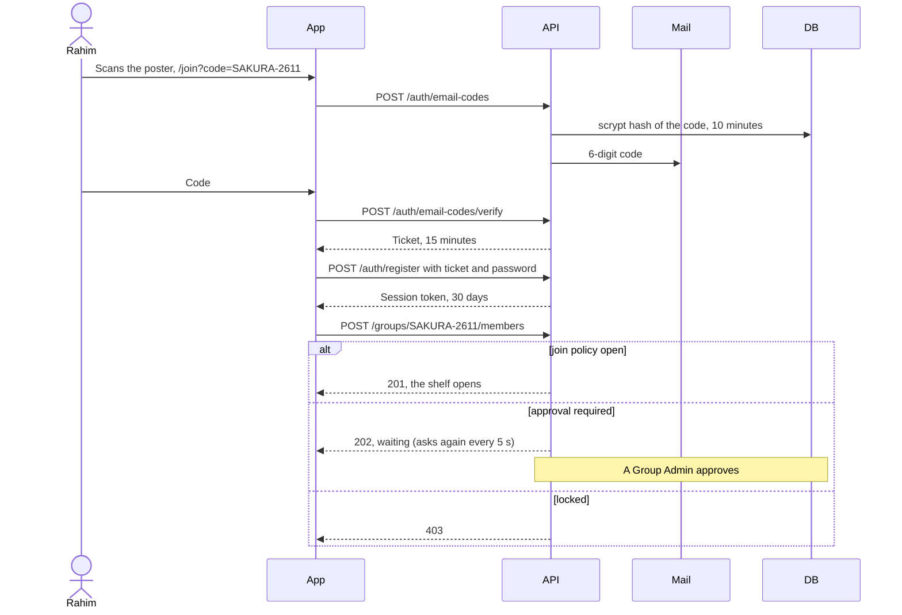
```mermaid
sequenceDiagram
  actor R as Rahim
  participant App
  participant API
  participant Mail
  participant DB
  R->>App: Scans the poster, /join?code=SAKURA-2611
  App->>API: POST /auth/email-codes
  API->>DB: scrypt hash of the code, 10 minutes
  API->>Mail: 6-digit code
  R->>App: Code
  App->>API: POST /auth/email-codes/verify
  API-->>App: Ticket, 15 minutes
  App->>API: POST /auth/register with ticket and password
  API-->>App: Session token, 30 days
  App->>API: POST /groups/SAKURA-2611/members
  alt join policy open
    API-->>App: 201, the shelf opens
  else approval required
    API-->>App: 202, waiting (asks again every 5 s)
    Note over API,DB: A Group Admin approves
  else locked
    API-->>App: 403
  end
```

### 8.2 Borrowing, handover, reminder, return

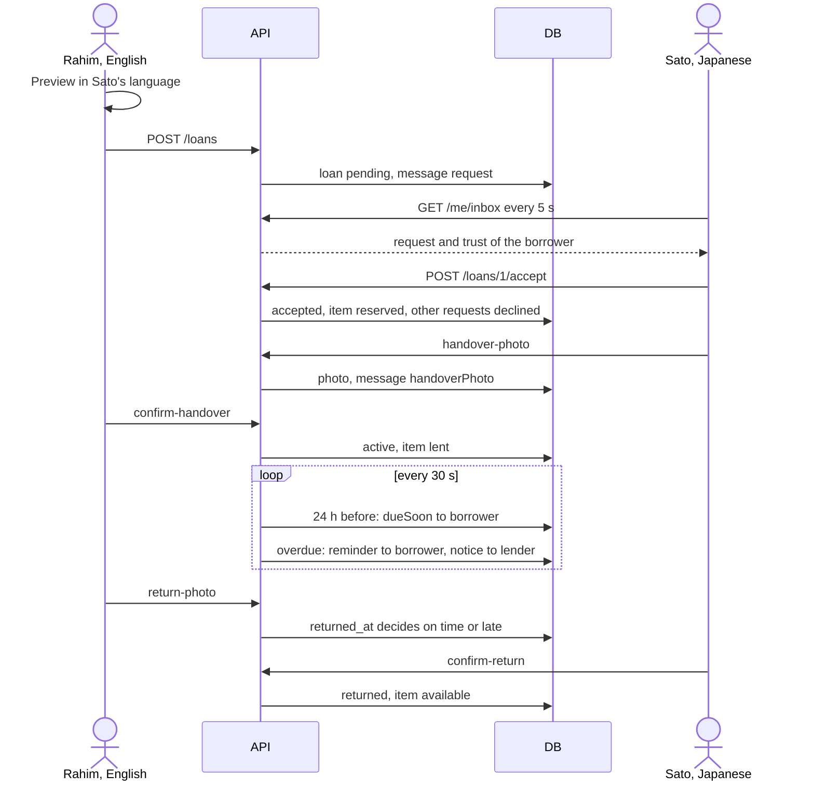
```mermaid
sequenceDiagram
  actor B as Rahim, English
  participant API
  participant DB
  actor L as Sato, Japanese
  B->>B: Preview in Sato's language
  B->>API: POST /loans
  API->>DB: loan pending, message request
  L->>API: GET /me/inbox every 5 s
  API-->>L: request and trust of the borrower
  L->>API: POST /loans/1/accept
  API->>DB: accepted, item reserved, other requests declined
  L->>API: handover-photo
  API->>DB: photo, message handoverPhoto
  B->>API: confirm-handover
  API->>DB: active, item lent
  loop every 30 s
    API->>DB: 24 h before: dueSoon to borrower
    API->>DB: overdue: reminder to borrower, notice to lender
  end
  B->>API: return-photo
  API->>DB: returned_at decides on time or late
  L->>API: confirm-return
  API->>DB: returned, item available
```

### 8.3 Requesting an item that is not in the catalog

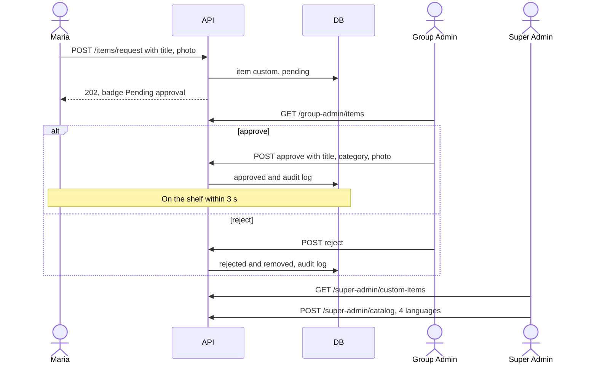
```mermaid
sequenceDiagram
  actor M as Maria
  participant API
  participant DB
  actor G as Group Admin
  actor S as Super Admin
  M->>API: POST /items/request with title, photo
  API->>DB: item custom, pending
  API-->>M: 202, badge Pending approval
  G->>API: GET /group-admin/items
  alt approve
    G->>API: POST approve with title, category, photo
    API->>DB: approved and audit log
    Note over M,DB: On the shelf within 3 s
  else reject
    G->>API: POST reject
    API->>DB: rejected and removed, audit log
  end
  S->>API: GET /super-admin/custom-items
  S->>API: POST /super-admin/catalog, 4 languages
```

### 8.4 Dispute and Break-Glass

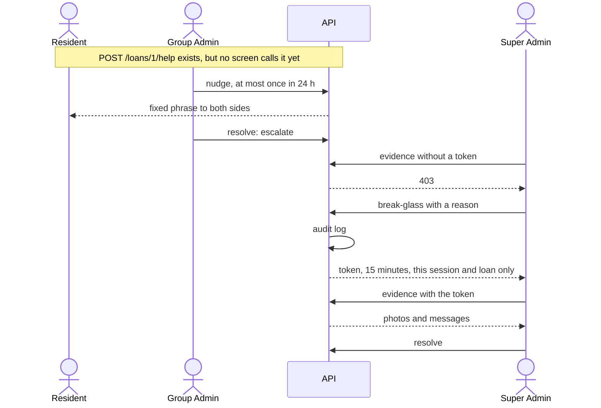
```mermaid
sequenceDiagram
  actor R as Resident
  actor G as Group Admin
  participant API
  actor S as Super Admin
  Note over R,API: POST /loans/1/help exists, but no screen calls it yet
  G->>API: nudge, at most once in 24 h
  API-->>R: fixed phrase to both sides
  G->>API: resolve: escalate
  S->>API: evidence without a token
  API-->>S: 403
  S->>API: break-glass with a reason
  API->>API: audit log
  API-->>S: token, 15 minutes, this session and loan only
  S->>API: evidence with the token
  API-->>S: photos and messages
  S->>API: resolve
```

## 9. State machines

Loan:

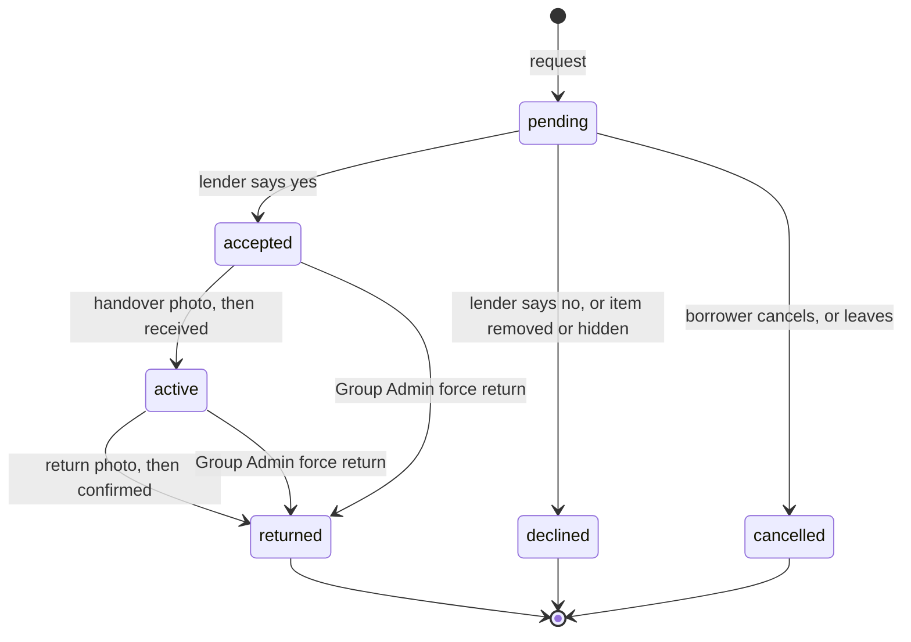
```mermaid
stateDiagram-v2
  [*] --> pending: request
  pending --> accepted: lender says yes
  pending --> declined: lender says no, or item removed or hidden
  pending --> cancelled: borrower cancels, or leaves
  accepted --> active: handover photo, then received
  active --> returned: return photo, then confirmed
  accepted --> returned: Group Admin force return
  active --> returned: Group Admin force return
  declined --> [*]
  cancelled --> [*]
  returned --> [*]
```

Item (approval and visibility; `available`, `reserved` and `lent` follow the loan):

```mermaid
stateDiagram-v2
  [*] --> Approved: from the catalog
  [*] --> PendingApproval: custom request
  PendingApproval --> Approved: Group Admin approves
  PendingApproval --> Rejected: Group Admin rejects
  Approved --> Hidden: Group Admin, only if available
  Hidden --> Approved: restore
  Approved --> Removed: owner, only if available
  Rejected --> [*]
  Removed --> [*]
```

Member:

```mermaid
stateDiagram-v2
  [*] --> pending: approval required
  [*] --> active: open group
  pending --> active: approved
  pending --> [*]: declined
  active --> borrow_muted: muted, with or without an end
  borrow_muted --> active: unmuted or time is over
  active --> suspended
  borrow_muted --> suspended
  suspended --> active: reinstated
  suspended --> borrow_muted
  active --> [*]: leaves or safely removed, no open loan
```

## 10. API

All under `/api/v1`, JSON, `Authorization: Bearer <token>` unless marked public. `GET /api/health` has no version.

| Area | Routes |
|---|---|
| Public | `GET /auth/config`, `POST /auth/email-codes`, `/auth/email-codes/verify`, `/auth/register`, `/auth/login`, `/auth/login-with-code`, `/auth/google`, `/auth/reset-password`; `GET /groups/:code`, `/catalog`, `/categories` |
| Me | `GET, PATCH /me`; `POST /me/password`; `POST, DELETE /me/avatar`; `DELETE /me/group`, `/auth/session` |
| Group | `POST /groups`, `/groups/:code/members`; `GET /group/announcement`; older: `/me/group/members`, `/me/group/change-code` |
| Items | `GET, POST /items`; `GET, PATCH, DELETE /items/:id`; `POST /items/request`; `GET /me/items` |
| Loans | `GET, POST /loans`; `GET /loans/:id`; `POST /loans/:id/` `accept`, `decline`, `cancel`, `handover-photo`, `confirm-handover`, `return-photo`, `confirm-return`, `messages`, `help` |
| Inbox | `GET /me/inbox`, `POST /me/inbox/mark-read` |
| Group Admin | `/group-admin/` `dashboard`, `members/...`, `settings`, `image`, `invite-code/rotate`, `items/...`, `loans/...`, `announcements`, `activity-log` |
| Super Admin | `/super-admin/` `overview`, `operations/...`, `groups/...`, `catalog`, `categories`, `custom-items`, `disputes/...`, `audit-logs`; `/admin/groups`, `/admin/users` |
| Demo mode | `POST /demo/loans/:id/fast-forward` |

## 11. Security and privacy

| Topic | How |
|---|---|
| Passwords, codes | scrypt; codes: 10 minutes, 5 attempts |
| Sessions | random token, only its SHA-256 is stored, 30 days |
| Attempts | limited per address and per IP (in memory) |
| Access | checks on the server for every route; other groups get 403 or 404 |
| Input | allowlists; messages can only be known phrase keys |
| Photos | image bytes checked, 5 MB, redrawn in the browser without GPS, random names, private S3 with signed URLs. Without S3 they are public to whoever knows the random URL |
| Loan details | the two participants; Group Admins for loans of their group (mediation); Super Admins only with an audited reason |
| Emails | their owner and Super Admins |
| Demo accounts | public password, work only with `DEMO_MODE=true` |

## 12. Completion status

Checked by calling the API as every kind of user on a fresh database: **113 of 119 checks passed**; plus 12 automated
tests (`server/tests`). Google login, email delivery, S3 and the deployed site were not part of it.

| Journey | Checks | Status |
|---|---|---|
| Visitor | 3 / 3 | complete |
| Register, log in, reset password | 8 / 8 | complete |
| Account without a group | 3 / 3 | complete |
| Borrow, handover, reminder, return | 27 / 27 | complete |
| Trust | 3 / 3 | complete |
| Lender | 6 / 6 | complete |
| Language, Elder Mode, profile | 5 / 5 | complete |
| Applicant | 5 / 6 | cannot withdraw |
| Muted and suspended | 5 / 7 | suspended people cannot finish a loan or leave |
| Group Admin | 18 / 20 | only member cannot leave; one old route is not audited |
| Item requests | 5 / 6 | requester is not told about a rejection |
| Super Admin | 22 / 22 | complete |
| Privacy | 3 / 3 | complete |

### Known gaps

| # | Gap | Impact |
|---|---|---|
| 1 | A suspended resident cannot finish an open loan or leave | a lender can lose contact with the item |
| 2 | The only member of a group cannot leave it | somebody else must join and be promoted first |
| 3 | An applicant cannot withdraw | must wait for a decision |
| 4 | No button for "ask the admin for help" (the API exists) | residents must ask in person |
| 5 | A rejected request disappears without a message | unclear for the requester |
| 6 | Custom titles are not translated; promoting does not convert existing items | shown as written |
| 7 | Two older group routes write no audit entry | incomplete log |
| 8 | A suspended resident sees a general error instead of an explanation | confusing |

## 13. Trade-offs and next steps

| Decision | Why | Limit |
|---|---|---|
| Fixed phrases | same meaning for everybody, no abuse, no AI cost | no unusual details |
| Polling instead of push | simple, survives sleeping phones | a few seconds of delay |
| Modular monolith, one write lock | nobody can get the same item twice | one server |
| Equal group admins | no single owner to lose | one admin can remove another |
| Custom titles with approval | not limited to the catalog | not translated |

Planned: close the gaps above, push notifications, more languages, stronger join verification, review of the new
labels by native speakers, end-to-end tests in the browser.
